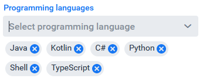

## vaadin-chip-combobox
A ComboBox with Chips/Chip Components for Vaadin Flow

## Installation
[Installation guide for the latest release](https://github.com/xdev-software/vaadin-chip-combobox/releases/latest#Installation)

## Run the Demo
1. Checkout the repo
2. Run ``mvn clean install``
3. Navigate into ``vaadin-chip-combobox-demo``
4. Run ``mvn jetty:run``
5. Open http://localhost:8080

   
Show example

   

## Releasing 
If the ``develop`` is ready for release, create a pull request to the ``master``-Branch and merge the changes

When the release is finished do the following:
* Merge the auto-generated PR (with the incremented version number) back into the ``develop``
* Add the release notes to the [GitHub release](https://github.com/xdev-software/vaadin-chip-combobox/releases/latest)
* Upload the generated release asset zip into the [Vaadin Directory](https://vaadin.com/directory)

## Dependencies and Licenses
View the [license of the current project](LICENSE) or the [summary including all dependencies](https://xdev-software.github.io/vaadin-chip-combobox/dependencies/)
